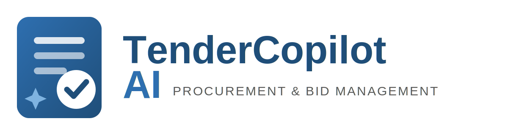

<p align="center">
  
</p>

# TenderCopilot AI — Master Guide

AI-powered procurement & bid management platform for Indian SMBs, MSMEs and bid
consultants. Ingests public-sector tenders (GeM, CPPP, state portals, PSUs), scores each
opportunity against a company profile, generates compliant proposals (DOCX), and tracks the
bid lifecycle through a Kanban CRM. Built against **Technical Specification v6.2** (cloud-only,
budget-PaaS, multi-tenant SaaS).

> **This README is the single source of truth for operating and changing the platform.**
> It documents every service, every environment variable, the architecture, where each feature
> lives in the code, and step-by-step recipes for common changes. For the click-by-click
> account-creation runbook see **[DEPLOYMENT.md](DEPLOYMENT.md)**.

---

## Table of contents

1. [Live environment](#1-live-environment)
2. [Services & apps used (and why)](#2-services--apps-used-and-why)
3. [Environment variables — complete reference](#3-environment-variables--complete-reference)
4. [Architecture — how it fits together](#4-architecture--how-it-fits-together)
5. [Codebase map](#5-codebase-map)
6. [Data model & migrations](#6-data-model--migrations)
7. [Feature → code map](#7-feature--code-map)
8. [Local development](#8-local-development)
9. [Making common changes (recipes)](#9-making-common-changes-recipes)
10. [Deployment & CI/CD](#10-deployment--cicd)
11. [Operations runbook](#11-operations-runbook)
12. [Security model](#12-security-model)
13. [Troubleshooting](#13-troubleshooting)
14. [Deviations from spec & staged work](#14-deviations-from-spec--staged-work)

---

## 1. Live environment

| | Value |
|---|---|
| **Production URL** | `https://www.tendercopilot.in` (apex `tendercopilot.in` 308-redirects to `www`) |
| **Repository** | `https://github.com/alvionixedge/TenderCopilot` |
| **Production branch** | `main` — every merge auto-deploys to production via Vercel |
| **Preview** | Every branch push builds an isolated Vercel preview (SSO-protected) |
| **Health check** | `https://www.tendercopilot.in/api/health` → `{"status":"ok","database":"ok","version":"<git sha>"}` |

**Cloud-only (spec §2.4):** the app is never deployed to or run on a local/self-hosted server
in production. All environments run on managed PaaS. Local runs are for authoring/testing only.

**Canonical host is `www`** — use `https://www.tendercopilot.in` in all new configuration (OAuth
redirect URIs, webhook URLs, `NEXT_PUBLIC_APP_URL`).

---

## 2. Services & apps used (and why)

Every third-party service, what it does, and which env vars it powers. "Required" = the core
product breaks without it; "Optional" = the app degrades gracefully (logs a warning, disables
that one feature) when unset.

| Service | Dashboard | Purpose in TenderCopilot | Powers env vars | Status |
|---|---|---|---|---|
| **Vercel** | vercel.com | Hosting, serverless functions, edge CDN, build/deploy, **cron scheduler**, and the encrypted **environment-variable store** (all secrets live here) | (reads all vars at build/runtime) | **Required** |
| **GitHub** | github.com | Source of truth; `main` = production. GitHub Actions runs the CI gate (typecheck + lint + test) | — | **Required** |
| **Neon** | neon.tech | Serverless PostgreSQL (+ pgvector). Single source of truth for all data. Branchable for previews | `DATABASE_URL`, `DATABASE_POOL_URL` | **Required** |
| **Google Cloud** | console.cloud.google.com | Google OAuth sign-in (OpenID Connect) | `AUTH_GOOGLE_ID`, `AUTH_GOOGLE_SECRET` | **Required** (for Google login) |
| **Microsoft Entra ID** | portal.azure.com | Microsoft OAuth sign-in | `AUTH_MICROSOFT_ENTRA_ID_ID/_SECRET/_ISSUER` | Optional |
| **Anthropic** | console.anthropic.com | Claude API — AI reasoning for tender scoring and proposal generation (`claude-haiku-4-5`) | `ANTHROPIC_API_KEY`, `ANTHROPIC_MODEL` | Optional (falls back to deterministic scoring/templates) |
| **Cloudflare R2** | dash.cloudflare.com | Private object storage for uploaded company documents (pre-signed URLs, quarantine→documents flow) | `R2_ACCOUNT_ID`, `R2_ACCESS_KEY_ID`, `R2_SECRET_ACCESS_KEY`, `R2_BUCKET_DOCUMENTS`, `R2_BUCKET_QUARANTINE` | Optional (upload UI hidden if unset) |
| **Upstash Redis** | upstash.com | Sliding-window rate limiting on AI routes and the public free-check/lead endpoints | `UPSTASH_REDIS_REST_URL`, `UPSTASH_REDIS_REST_TOKEN` | Optional (no limits if unset) |
| **Resend** | resend.com | Transactional email — the free-check funnel's welcome + "matching tenders" emails | `RESEND_API_KEY`, `RESEND_FROM_EMAIL` | Optional (leads still captured, no email sent) |
| **Razorpay** | razorpay.com | Payments — one-time monthly payments and recurring subscriptions; webhooks drive plan lifecycle | `RAZORPAY_KEY_ID`, `RAZORPAY_KEY_SECRET`, `RAZORPAY_WEBHOOK_SECRET`, `RAZORPAY_PLAN_PRO`, `RAZORPAY_PLAN_BUSINESS` | Optional (Billing shows "not configured" if unset) |

### Reserved / declared but not yet wired in code
These appear in `.env.example` for the roadmap but are **not read by current code**. Setting them
does nothing yet; they're placeholders for staged milestones:

| Var(s) | Intended purpose | Milestone |
|---|---|---|
| `OPENAI_API_KEY`, `OPENAI_EMBEDDING_MODEL` | Embeddings + AI fallback provider | pgvector semantic matching (§10.1) |
| `QSTASH_TOKEN`, `QSTASH_CURRENT_SIGNING_KEY`, `QSTASH_NEXT_SIGNING_KEY` | Async job queue for long-running generation | Background workers (§9.2) |
| `NEXT_PUBLIC_SENTRY_DSN`, `SENTRY_AUTH_TOKEN` | Error monitoring | Observability |
| `NEXT_PUBLIC_POSTHOG_KEY`, `NEXT_PUBLIC_POSTHOG_HOST` | Product analytics | Observability |
| `R2_PUBLIC_URL` | Public asset base (unused — objects served via signed URLs) | — |

---

## 3. Environment variables — complete reference

**All secrets are entered in Vercel → Settings → Environment Variables — never in GitHub, never
committed.** Scope each to **Production** (and **Preview** if you want previews to have it).
`.env.example` is the committed template with empty values.

### Required (core product)

| Variable | What it does | Where to get it |
|---|---|---|
| `DATABASE_URL` | Neon **direct** (non-pooled) connection — used by migrations | Neon → Connection Details, direct string |
| `DATABASE_POOL_URL` | Neon **pooled** connection — used by the running app | Neon → Connection Details, `-pooler` string |
| `AUTH_SECRET` | Signs/encrypts session JWTs (NextAuth) | `openssl rand -base64 32` |
| `AUTH_TRUST_HOST` | `true` — lets NextAuth trust the deployment host | literal `true` |
| `AUTH_GOOGLE_ID` / `AUTH_GOOGLE_SECRET` | Google OAuth client | Google Cloud → Credentials → OAuth client |
| `CRON_SECRET` | Bearer token the cron ingestion route requires | `openssl rand -base64 32` |
| `NEXT_PUBLIC_APP_URL` | Base URL for links in emails and metadata | `https://www.tendercopilot.in` |
| `ADMIN_EMAILS` | Comma-separated emails allowed to see the platform-wide `/admin` Ops dashboard | your founder/ops email(s) |

### Recommended

| Variable | What it does | Where to get it |
|---|---|---|
| `ANTHROPIC_API_KEY` | Claude API access (AI scoring & proposals) | console.anthropic.com → API keys |
| `ANTHROPIC_MODEL` | Model id — default `claude-haiku-4-5` | literal |

### Optional (each unlocks one feature)

| Variable | Feature |
|---|---|
| `AUTH_MICROSOFT_ENTRA_ID_ID` / `_SECRET` / `_ISSUER` | Microsoft sign-in |
| `R2_ACCOUNT_ID`, `R2_ACCESS_KEY_ID`, `R2_SECRET_ACCESS_KEY`, `R2_BUCKET_DOCUMENTS`, `R2_BUCKET_QUARANTINE` | Company-document uploads |
| `UPSTASH_REDIS_REST_URL`, `UPSTASH_REDIS_REST_TOKEN` | Rate limiting (AI routes + public endpoints) |
| `RESEND_API_KEY`, `RESEND_FROM_EMAIL` | Free-check funnel emails |
| `RAZORPAY_KEY_ID`, `RAZORPAY_KEY_SECRET`, `RAZORPAY_WEBHOOK_SECRET` | Payments (one-time + recurring) |
| `RAZORPAY_PLAN_PRO`, `RAZORPAY_PLAN_BUSINESS` | Recurring subscriptions ("Subscribe" buttons) |

> **After changing any env var, redeploy** (Vercel → Deployments → ⋯ → Redeploy). Env changes
> only apply to new deployments.

---

## 4. Architecture — how it fits together

```
                         ┌──────────────────────────────────────────────┐
  Browser  ───HTTPS───▶  │  Next.js 15 app on Vercel (edge + serverless) │
                         │  • React Server/Client Components (UI)         │
                         │  • Route Handlers = the /api surface           │
                         └───────┬───────────────┬───────────────┬───────┘
                                 │               │               │
                     Drizzle (pooled)      server-only       server-only
                                 │               │               │
                         ┌───────▼──────┐  ┌─────▼──────┐  ┌─────▼───────────┐
                         │ Neon Postgres│  │ Claude API │  │ Cloudflare R2   │
                         │ + pgvector   │  │ (Anthropic)│  │ (private docs)  │
                         └──────────────┘  └────────────┘  └─────────────────┘
                                 ▲               ▲
                     Vercel Cron │       Upstash │ (rate limit)   Resend (email)
                     (daily)  ───┘               │                Razorpay (pay + webhooks)
```

- **Single deployment:** frontend + API ship as one Vercel deployment. No separate API server.
- **Server boundary:** all DB, AI, storage, and payment secrets are server-only; never shipped to
  the browser. The browser only ever gets short-lived pre-signed URLs and the public Razorpay key.
- **Tenancy:** the *organization* is the tenant. Every tenant-scoped table carries `org_id`, and
  the active org/company is resolved server-side from the session — never from client input.
- **Payments loop:** browser opens Razorpay Checkout → server verifies the signature → the
  **webhook** (`/api/webhooks/razorpay`) is the source of truth for renewals/cancellations.

---

## 5. Codebase map

```
TenderCopilot/
├── README.md                 ← this file (master guide)
├── DEPLOYMENT.md             ← click-by-click account setup + deploy runbook
├── .env.example              ← env-var template (empty values)
├── vercel.json               ← Vercel cron schedule (daily tender ingestion)
├── drizzle.config.ts         ← Drizzle migration config (uses DATABASE_URL)
├── next.config.ts            ← security headers, Next config
├── .github/workflows/ci.yml  ← CI gate: typecheck + lint + test (on PRs to main)
├── drizzle/                  ← versioned SQL migrations (auto-applied at deploy)
│   ├── 0000_init.sql         ← full initial schema (+ CREATE EXTENSION vector)
│   ├── 0001_billing_and_account.sql  ← payment_events + users.password_hash/deactivated_at
│   └── 0002_leads.sql        ← leads (free-check funnel)
├── scripts/
│   ├── migrate.mjs           ← runs drizzle-kit migrate in the Vercel build (fail-safe)
│   └── seed.mjs              ← seeds plan_features (idempotent) — run once after first deploy
├── public/brand/             ← logo.png, logo.svg, mark.png
├── tests/                    ← Vitest unit tests (scoring, entitlements, razorpay, password)
└── src/
    ├── auth.ts               ← NextAuth v5 config: Google + Microsoft + email/password
    ├── db/
    │   ├── schema.ts         ← Drizzle schema — ALL tables (spec §3 data model)
    │   └── index.ts          ← lazy Drizzle client (pooled), isDbConfigured()
    ├── lib/                  ← business logic (see Feature → code map)
    ├── components/           ← React components (client + shared)
    └── app/
        ├── page.tsx          ← marketing landing page
        ├── signin/           ← sign-in (Google + email/password)
        ├── free-check/       ← public eligibility checker (ad landing page)
        ├── (legal)/          ← /privacy /security /terms /refunds (public, static)
        ├── (app)/            ← authenticated app (dashboard, tenders, proposals, pipeline,
        │                        company, billing, settings) — layout enforces auth
        └── api/
            ├── auth/[...nextauth]/  ← NextAuth handler
            ├── health/              ← post-deploy health check
            ├── cron/ingest/         ← scheduled tender ingestion (needs CRON_SECRET)
            ├── webhooks/razorpay/   ← signature-verified payment webhook
            └── v1/                  ← the app API (companies, tenders, proposals,
                                        opportunities, billing, account, free-check, leads)
```

---

## 6. Data model & migrations

- **ORM:** Drizzle. Schema is defined once in **`src/db/schema.ts`**; SQL migrations are generated
  from it into `drizzle/` and committed.
- **Migrations run automatically** during the Vercel build (`scripts/migrate.mjs` → `drizzle-kit
  migrate`), before the app goes live. A failed migration fails the build and keeps the previous
  release serving (fail-safe).
- **Migrations are idempotent** (`IF NOT EXISTS`, guarded constraints) so they're safe to re-run
  against a partially-migrated database.
- **Current migration chain:** `0000_init` → `0001_billing_and_account` → `0002_leads`.

Key tables (all in `schema.ts`): `organizations`, `users`, `memberships`, `companies`,
`company_documents`, `tenders`, `tender_versions`, `tender_requirements`, `tender_matches`,
`proposals`, `proposal_versions`, `opportunities`, `bid_outcomes`, `jobs`, `audit_log`,
`ai_generations`, `subscriptions`, `plan_features`, `usage_counters`, `invitations`, `sessions`,
`payment_events`, `notifications`, `leads`.

---

## 7. Feature → code map

Where to look/change for each feature:

| Feature | Code |
|---|---|
| **Auth (Google / Microsoft / email-password)** | `src/auth.ts`, provisioning `src/lib/provision.ts`, password hashing `src/lib/password.ts` |
| **Sign-in / sign-up UI** | `src/app/signin/page.tsx`, `src/components/credentials-form.tsx` |
| **Tender scoring engine** (match / eligibility / win) | `src/lib/scoring.ts` |
| **AI reasoning & traceability** | `src/lib/ai.ts` (Claude call + `ai_generations` logging) |
| **Proposal generation** (Claude + template fallback) | `src/lib/proposal.ts`, DOCX render `src/lib/docx.ts` |
| **Tender ingestion source** | `src/lib/tender-feed.ts` (live feed via `TENDER_FEED_URL` + sample fallback `src/lib/sample-tenders.ts`), cron `src/app/api/cron/ingest/route.ts` |
| **Company documents / R2 uploads** | `src/lib/r2.ts`, route `src/app/api/v1/companies/[id]/documents/route.ts` |
| **Plan limits / usage metering** | `src/lib/entitlements.ts` (`DEFAULT_LIMITS`, `consumeEntitlement`) |
| **Plans & pricing** | `src/lib/plans.ts` (`PLANS`) + seeded `plan_features` (`scripts/seed.mjs`) |
| **Billing (Razorpay)** | `src/lib/razorpay.ts`, `src/lib/billing.ts`, routes under `src/app/api/v1/billing/`, webhook `src/app/api/webhooks/razorpay/route.ts`, UI `src/app/(app)/billing/page.tsx` |
| **Cancellation** | `scheduleCancellation` in `src/lib/billing.ts`, `src/components/cancel-button.tsx` |
| **Free-check funnel** | page `src/app/free-check/page.tsx`, form `src/components/free-check-form.tsx`, scoring API `src/app/api/v1/free-check/route.ts` |
| **Lead capture + emails** | `src/lib/leads.ts`, `src/lib/email.ts`, route `src/app/api/v1/leads/route.ts` |
| **Account deactivation / deletion** | `src/lib/account.ts`, routes under `src/app/api/v1/account/`, UI `src/components/account-danger.tsx` |
| **Legal pages** | `src/app/(legal)/{privacy,security,terms,refunds}/page.tsx`, shared `src/components/legal.tsx` |
| **Rate limiting** | `src/lib/ratelimit.ts` |
| **Audit log** | `src/lib/audit.ts` |
| **CRM pipeline** | `src/app/(app)/pipeline/page.tsx`, route `src/app/api/v1/opportunities/[id]/route.ts` |

---

## 8. Local development

Local runs are for **authoring/testing only** — never serve real users locally (cloud-only mandate).

```bash
git clone https://github.com/alvionixedge/TenderCopilot.git
cd TenderCopilot
npm install
cp .env.example .env.local        # fill in values (use a Neon DEV branch, not production)
npm run dev                        # http://localhost:3000
```

| Command | Purpose |
|---|---|
| `npm run dev` | Local dev server |
| `npm run typecheck` | `tsc --noEmit` |
| `npm run lint` | ESLint |
| `npm run test` | Vitest unit tests |
| `npm run build` | Full production build (runs migrations first, then `next build`) |
| `npm run db:generate` | Generate a new migration after editing `schema.ts` |
| `npm run db:migrate` | Apply migrations (also runs automatically in the Vercel build) |
| `npm run db:seed` | Seed `plan_features` (idempotent) |

> Always run `npm run typecheck && npm run lint && npm run test && npm run build` before pushing.

---

## 9. Making common changes (recipes)

### Add or change an environment variable / secret
Vercel → Settings → Environment Variables → add/edit (Production + Preview) → **Redeploy**.
Document it in `.env.example` and (if it's a new service) in [§2](#2-services--apps-used-and-why).

### Change a database table (add a column, new table, etc.)
1. Edit `src/db/schema.ts`.
2. `npm run db:generate` → creates a new `drizzle/000N_*.sql`.
3. Review the SQL. **Make it additive** (nullable columns / new tables) so it's safe during the
   deploy overlap window (expand-then-contract). For extra safety, hand-edit to use
   `IF NOT EXISTS` / guarded constraints (see existing migrations).
4. Commit the schema **and** the migration together. The Vercel build applies it automatically.

### Change pricing or plan limits
- **Displayed price & Razorpay amount:** `src/lib/plans.ts` (`PLANS[*].amountInr` / `amountPaise`).
- **Usage caps (proposals/month, companies, seats, tenders/day):** `src/lib/entitlements.ts`
  (`DEFAULT_LIMITS`) **and** the seeded `plan_features` rows in `scripts/seed.mjs` — keep them in
  sync, then re-run `npm run db:seed`.
- **Recurring amounts** are set by the Razorpay **Plan** objects (dashboard) — if you change a
  price, create a new Plan and update `RAZORPAY_PLAN_PRO` / `RAZORPAY_PLAN_BUSINESS`.

### Change Razorpay plans (see [§11](#11-operations-runbook) for full billing ops)
Create/replace the Plan in the Razorpay dashboard → copy the new `plan_…` id → update the env var
→ redeploy. Test-mode and Live-mode plans are separate objects.

### Connect a real (live) tender source
Ingestion is pluggable (`src/lib/tender-feed.ts`), resolved in this order:

1. **`TENDER_FEED_URL` set** → fetch a provider's JSON feed (+ `TENDER_FEED_API_KEY` if it needs
   auth). Must return an array (or `{items|tenders|data|records:[...]}`) of objects with at least
   `sourceUrl` + `title`; other fields (`source`, `department`, `estimatedValue`, `emd`,
   `submissionDate` or `daysToDeadline`, `requirements[]`) are optional and mapped in
   `feedItemSchema`. Adjust that schema if a provider's shape differs.
2. **`TENDER_CRAWL_CPPP=true`** (and no feed URL) → **direct crawler for the Central Public
   Procurement Portal** (`eprocure.gov.in`), which aggregates central/state/PSU tenders. **Free,
   no API key** — parses the public "latest active tenders" HTML listing (`src/lib/crawlers/cppp.ts`).
   `TENDER_CRAWL_PAGES` (default 5) controls how many 10-tender pages to pull per run.
3. **Neither** → built-in sample set (`src/lib/sample-tenders.ts`); the Tenders page shows a
   "Sample data" banner.

A configured live source that fails **fails the ingestion job** rather than silently serving
samples. The `ON CONFLICT (source_url)` upsert makes re-ingestion idempotent.

**Two ways to run the CPPP crawl:**
- **On Vercel** (simplest): set `TENDER_CRAWL_CPPP=true`; the daily cron crawls the listing. Good
  for listing-level data (title, org, deadline).
- **From GitHub Actions** (recommended for resilience + enrichment): the scheduled workflow
  `.github/workflows/crawl-tenders.yml` runs `scripts/crawl-cppp.ts` on GitHub's clean IPs (every
  6h), and POSTs into the secured **`POST /api/v1/tenders/ingest`** endpoint (Bearer `CRON_SECRET`).
  Set repo **secrets** `APP_URL` (`https://www.tendercopilot.in`) and `CRON_SECRET`. With repo
  **variable** `TENDER_CRAWL_ENRICH=true`, it renders each tender's (JS-only) detail page with
  Playwright to pull **estimated value, EMD, and a work-description requirement** (best-effort;
  `extractDetailFields`, unit-tested). When using the Action, leave `TENDER_CRAWL_CPPP` unset on
  Vercel so the two don't both run.

**Coverage:** CPPP is a **cross-government aggregator** — its feed already includes central
ministries, **state** tenders (Karnataka, Maharashtra, …) and **PSUs** (NTPC, GAIL, ONGC, BHEL,
Heavy Water Board, Railways, …), so you generally do **not** need separate crawlers per portal
(more `TENDER_CRAWL_PAGES` = more coverage across all of them). The crawler pulls the main
`latestactivetendersnew` listing plus the `highvaluetenders` and `globaltenders` listings. The
individual state/PSU portals (`tenders.karnataka.gov.in`, `mahatenders.gov.in`, `etenders.bhel.in`,
`tenders.ntpc.co.in`) are separate NIC/CAPTCHA systems that block automated access and are largely
redundant with CPPP. **GeM** (`gem.gov.in`) is a login-walled JS app and is **not** directly
crawlable — it needs a paid aggregator (BidAssist / Tender247 / TenderTiger) via `TENDER_FEED_URL`.
The CPPP crawler parses HTML, so a portal markup change can break it — the parser is isolated in
`src/lib/crawlers/cppp.ts` and unit-tested (`tests/cppp.test.ts`); for higher resilience, run the
crawler from a scheduled GitHub Action (clean IP) that POSTs into an ingestion endpoint rather than
from Vercel serverless.

### Edit the funnel emails
`src/lib/email.ts` — `welcomeEmail()` and `matchingTendersEmail()` (subject + HTML). The shared
shell is `emailShell()`.

### Edit legal pages / policies
`src/app/(legal)/{privacy,security,terms,refunds}/page.tsx`. Update the `UPDATED` date constant.

### Change the cron schedule
`vercel.json` → `crons[0].schedule` (cron syntax, UTC). Note: Vercel **Hobby** allows daily
granularity only; **Pro** allows finer (e.g. `0 */6 * * *` for 6-hourly).

---

## 10. Deployment & CI/CD

**Single path:** `git push` → GitHub Actions CI gate → Vercel build (`node scripts/migrate.mjs &&
next build`) → atomic promote. A migration or build failure keeps the previous release live.

- **PRs:** open against `main`. CI (`.github/workflows/ci.yml`) runs typecheck + lint + test.
- **Merge to `main`:** triggers the production deploy (migrations auto-apply to the Neon primary).
- **Rollback:** Vercel → Deployments → pick a prior build → **Promote to Production** (instant;
  migrations are additive so code rollback doesn't require schema rollback).
- **Preview branching (recommended):** install the Neon–Vercel integration so each preview gets an
  ephemeral DB branch instead of hitting production. See DEPLOYMENT.md §3.7.

Full first-time account setup (Neon, Google OAuth, Anthropic, R2, Upstash, Razorpay, secrets):
**[DEPLOYMENT.md](DEPLOYMENT.md)** — Phases 0–4.

---

## 11. Operations runbook

### Populate the tender feed (one-time / on demand)
The daily cron (`vercel.json`, 03:00 UTC) refreshes it; to trigger now:
```bash
curl -X POST https://www.tendercopilot.in/api/cron/ingest \
  -H "Authorization: Bearer <CRON_SECRET>"
```
Without this, the authenticated Tenders feed is empty and Analyze/Proposal have nothing to score.

### Seed plan entitlements (once after first deploy)
```bash
DATABASE_URL="<Neon DIRECT string>" npm run db:seed
```

### Billing — Razorpay (test vs live)
- **Test Mode:** keys `rzp_test_…`, test card `4111 1111 1111 1111` (any future expiry / any CVV →
  click "Success"), or UPI `success@razorpay`. No real money.
- **Live Mode:** keys `rzp_live_…`, **real money moves**; test cards are rejected. Test-mode and
  Live-mode keys, webhooks, and Plan IDs are all separate objects.
- **One-time "Pay once"** works with just `RAZORPAY_KEY_ID/SECRET/WEBHOOK_SECRET`. **Recurring
  "Subscribe"** additionally needs `RAZORPAY_PLAN_PRO` / `RAZORPAY_PLAN_BUSINESS`.
- **Webhook:** URL `https://www.tendercopilot.in/api/webhooks/razorpay`; its secret must equal
  `RAZORPAY_WEBHOOK_SECRET`. It's the source of truth for renewals/cancellations/refunds.
- **Safe live smoke test:** create a temporary ₹1 Live Plan, point `RAZORPAY_PLAN_PRO` at it, do a
  real ₹1 Subscribe, verify, then switch back to the real plan and redeploy.

### Cancellation & refunds
- Users cancel from **Billing** (or `POST /api/v1/billing/cancel`) — cancels the Razorpay
  subscription at cycle end and sets `cancel_at_period_end`; access continues to period end.
- **Policy:** cancel anytime, no charge going forward, **amounts already paid are non-refundable**
  (`/refunds`).

### Account lifecycle
- **Deactivate** (`/api/v1/account/deactivate`): reversible; clears on next login.
- **Delete** (`DELETE /api/v1/account`): permanent RTBF — cascades all solely-owned org data + the
  user + any lead with that email, in one transaction. Blocked if the org has other members.

### Rate limits
Configured in `src/lib/ratelimit.ts` (needs Upstash): AI routes per user+org; public free-check
30/min/IP; lead capture 6/min/IP.

---

## 12. Security model

- **OAuth + first-party email/password.** Passwords are **scrypt-hashed with a per-user salt**
  (`src/lib/password.ts`); raw passwords are never stored or logged. (Email/password is a
  deliberate deviation from spec §5.1, which was OAuth-only.)
- **Sessions:** signed, HTTP-only, Secure JWT cookies (NextAuth).
- **Tenant isolation:** every query is scoped by `org_id` derived from the session; authorization
  re-checked server-side on every route. (Database-level RLS is staged — see §14.)
- **Secrets:** server-only, stored in Vercel's encrypted env store; never in the repo or browser.
- **Documents:** private R2 bucket, short-lived (≤300s) single-object pre-signed URLs, non-guessable
  tenant-prefixed keys; uploads land in a quarantine bucket.
- **Webhooks:** Razorpay webhooks are HMAC-signature-verified; the cron route requires `CRON_SECRET`.
- **Security headers:** HSTS, `X-Frame-Options: DENY`, `nosniff`, Referrer-Policy, Permissions-Policy
  (`next.config.ts`).
- **Audit log:** append-only record of significant actions (`src/lib/audit.ts`).

---

## 13. Troubleshooting

| Symptom | Cause / fix |
|---|---|
| Build fails at `[migrate]` | Bad `DATABASE_URL` (must be the **direct**, non-pooled string), or a non-idempotent migration hitting existing objects — make migrations `IF NOT EXISTS`. Previous release stays live |
| "Sign-in is not configured" | `AUTH_SECRET` / `AUTH_GOOGLE_ID/SECRET` missing → add + redeploy |
| Google `redirect_uri_mismatch` | The redirect URI in Google Cloud must exactly match `https://www.tendercopilot.in/api/auth/callback/google` |
| Google `invalid_client` | `AUTH_GOOGLE_ID/SECRET` is wrong or still a placeholder |
| "Recurring billing not configured" | `RAZORPAY_PLAN_PRO`/`_BUSINESS` unset → create Plans, set the IDs, redeploy |
| Payment succeeds but plan doesn't upgrade | `RAZORPAY_WEBHOOK_SECRET` in Vercel ≠ the secret on the Razorpay webhook; or wrong mode (test webhook with live keys) |
| Empty Tenders feed | Ingestion never ran → trigger the cron (see §11) |
| Proposals are template, not AI | `ANTHROPIC_API_KEY` unset/invalid/out of credit — by-design fallback |
| Preview build mutated production data | Env vars scoped to Preview share prod `DATABASE_URL` → install Neon preview branching (DEPLOYMENT.md §3.7) |

---

## 14. Deviations from spec & staged work

**Deliberate deviations (documented, secure):**
- First-party **email/password** auth (spec §5.1 was OAuth-only) — scrypt + per-user salt.

**Staged for later milestones (per the spec's own phased plan §10.4):**
Postgres **RLS** policies (app-layer org scoping for now); **QStash** async workers (generation
runs inline, `maxDuration` 60s); malware-scan worker for documents; **real portal crawlers**
(curated `sample-tenders.ts` today); **pgvector** semantic matching (heuristic scorer today);
SAML/SCIM & MFA; GST tax-invoice PDF generation; Sentry/PostHog observability. The tender
ingestion cron is **daily** (Vercel Hobby limit); the spec targets 6-hourly on Pro.
